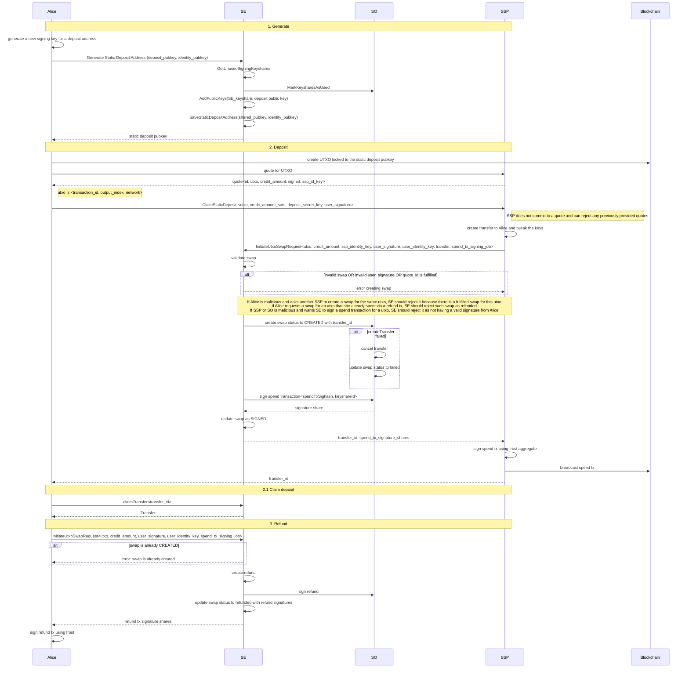

# Claim Static Deposit Flow

This is an exhaustive deep-dive into the complete call chain, database operations,
cryptographic signing, and transaction flow for static deposit claiming.

Core Flow: User creates a Static Deposit Address → User deposits BTC → Gets quote from SSP → Claims deposit (swap UTXO for transfer) → SSP calls an SO to coordinate a swap → Transfer created → UTXO spent on-chain



## Trust Model & Security Properties

### Atomicity Guarantee

The UTXO swap is **atomic** - either both sides complete or both sides fail. This atomicity is enforced by the **Signing Operators (SOs)**, not cryptographically which means the user has to trust the SOs.

**How Atomicity Works:**
1. **SOs create the transfer BEFORE signing the spend transaction**
2. **Transfer and UTXO swap are linked atomically** in the database
3. **SOs only provide spend tx signatures if a valid transfer exists**
4. **Two-phase commit** ensures all SOs agree or all rollback

**Result:** The spend transaction cannot be broadcast unless the user has received their Spark leaves.

### Trust Assumptions

**User trusts:**
- **At least 1-of-N SOs is honest** (standard Spark assumption)
  - If ≥1 honest SO exists, the user cannot be cheated
  - Honest SOs enforce that spend tx is only signed when transfer exists
  - Even if N-1 SOs are malicious, the honest SO prevents theft

**SSP trusts:**
- **SOs will provide signatures for spend transaction** after proper validation
- **SOs will validate the User's share of the deposit key** so the SSP can use it to produce a signature for the spend transaction

**User does NOT trust:**
- **SSP to provide leaves** - SOs enforce this, not SSP

**SSP does NOT trust:**
- **User to provide the correct deposit key** - SOs validate the user share
- **User to send a Bitcoin transaction** - It waits for 3 confirmations on the blockchain

### Security Properties

#### 1. **Atomicity: Transfer exists ⟺ Spend tx is signed**
- 🔒 **Enforced by:** SOs create transfer before signing
- **Guarantee:** User receives Spark leaves if and only if spend tx can be broadcast
- **Protection against:** SSP broadcasting spend tx without giving user leaves

#### 2. **User Authorization Required**
- 🔒 **Enforced by:** SO validates user signature
- **Guarantee:** UTXO cannot be spent without user's explicit authorization
- **Protection against:** Malicious SSP/SO spending user's UTXO without permission

#### 3. **Byzantine Fault Tolerance**
- 🔒 **Enforced by:** Two-phase commit across all SOs
- **Guarantee:** If any SO detects invalid swap, all SOs rollback
- **Protection against:** Inconsistent state across SOs, Byzantine SOs

#### 4. **No Double-Spend**
- 🔒 **Enforced by:** Unique index on `utxo_swaps(utxo_id)` WHERE status != 'CANCELLED'
- **Guarantee:** Each UTXO can only have one active swap at a time
- **Protection against:** User attempting to claim same UTXO through multiple SSPs

#### 5. **Rollback Safety**
- 🔒 **Enforced by:** Atomic database transactions and two-phase commit
- **Guarantee:** If swap creation fails, all state is cleaned up across all SOs
- **Protection against:** Orphaned swaps, locked UTXOs, inconsistent state

#### 6. **SSP Quote Non-Binding**
- ⚠️ **SSP can reject previously provided quotes** (line 34)
- **Reason:** Market conditions change, SSP liquidity varies
- **User protection:** User authorizes specific amount in their signature

## SDK

| Method                            | Purpose                                   |
|-----------------------------------|-------------------------------------------|
| getStaticDepositAddress()         | Generate static deposit address for user  |
| getClaimStaticDepositQuote()      | Get SSP quote (credit amount, signature)  |
| claimStaticDeposit()              | Primary claim method - executes UTXO swap |
| claimStaticDepositWithMaxFee()    | Claim with max fee threshold check        |
| refundStaticDeposit()             | Create refund transaction (returns hex)   |
| refundAndBroadcastStaticDeposit() | Refund + broadcast to Bitcoin network     |

## Deposit Address Generation


`generate_static_deposit_address` RPC creates a permanent, reusable Bitcoin P2TR (Taproot) address for users to deposit funds into Spark. Unlike single-use deposit addresses, static addresses can receive multiple deposits. The address is derived from a threshold signing keyshare combined with the user's signing public key, with all operators providing cryptographic proofs of possession.

### Call Chain

```
Handler: DepositHandler.GenerateStaticDepositAddress
    ├─ Validate network & identity
    ├─ Query for existing default static address
    │
    ├─ IF EXISTS: Return cached address
    │  ├─ Check for cached proofs
    │  └─ Return response with address + proofs
    │
    └─ IF NOT EXISTS: Generate new address
      ├─ Parse signing public key
      ├─ Get unused signing keyshare
      │
      ├─ Mark keyshare for address on all operators
      │  ↓
      │  MarkKeyshareForDepositAddressWithOtherOperators
      │      ├─ For each operator: MarkKeyshareForDepositAddress RPC
      │      └─ Local: MarkKeyshareForDepositAddress
      │         ├─ Validate keyshare ID
      │         ├─ Create DepositAddress entity
      │         │  └─ Fields: address, network, owner keys, is_static=true, is_default=true
      │         └─ Generate address signature
      │
      ├─ Calculate verifying key: keyshare.PublicKey + user signing pubkey
      ├─ Generate P2TR address from verifying key
      ├─ Create local DepositAddress record
      │
      ├─ Generate proofs from all operators
      │  ↓
      │  generateStaticDepositAddressProofs
      │      ├─ Check for cached proofs
      │      ├─ Self: GenerateStaticDepositAddressProofs (472-480)
      │      ├─ Others: ExecuteTaskWithAllOperators (483-515)
      │      │   └─ For each operator: GenerateStaticDepositAddressProofs RPC
      │      │       ↓
      │      │       InternalDepositHandler.GenerateStaticDepositAddressProofs
      │      │          ├─ Query deposit address by keyshare + identity + address
      │      │          ├─ Sign SHA256(address) with operator identity key
      │      │          └─ Return address signature
      │      │
      │      ├─ Aggregate signatures from all operators
      │      ├─ Generate proof of possession signature
      │      └─ Cache proofs in DB
      │
      └─ Return response
          └─ Address { address, verifying_key, deposit_address_proof, is_static=true }
```

### Database Entity

```
  | Field                 | Type   | Purpose                                                   |
  |-----------------------|--------|-----------------------------------------------------------|
  | id                    | UUID   | Primary key                                               |
  | address               | string | P2TR address (unique)                                     |
  | network               | Enum   | Bitcoin network (mainnet/testnet/regtest/signet)          |
  | owner_identity_pubkey | bytes  | User's identity public key                                |
  | owner_signing_pubkey  | bytes  | User's signing public key (used in address derivation)    |
  | is_static             | bool   | True for static addresses (default: false)                |
  | is_default            | bool   | True for default address per user/network (default: true) |
  | address_signatures    | JSON   | Map of operator_id → signature bytes                      |
  | possession_signature  | bytes  | FROST proof-of-possession signature                       |
  | confirmation_height   | int64  | Block height of confirmation                              |
  | confirmation_txid     | string | TXID of confirmation transaction                          |

  Edges:
  - signing_keyshare (Many-to-One, Required) → SigningKeyshare entity

  Unique Index:
  CREATE UNIQUE INDEX ON deposit_addresses(network, owner_identity_pubkey)
  WHERE is_static = true AND is_default = true
  Ensures: Only one default static address per (identity, network) pair
```

#### Related Entities

- SigningKeyshare
  - Contains threshold signing key material
  - Links to DepositAddress via edge
  - Fields: public_key, status (available/used/failed)

- Utxo
  - Multiple UTXOs can reference same DepositAddress (reusable address)
  - Fields: txid, vout, amount, network, pk_script, block_height

- UtxoSwap
  - Records claim/refund operations on static deposit UTXOs
  - Status: CREATED, COMPLETED, CANCELLED
  - RequestType: FIXED_AMOUNT, MAX_FEE, REFUND

### Error Handling

```
  | Error                 | When                                      | Handler Response                    |
  |-----------------------|-------------------------------------------|-------------------------------------|
  | InvalidArgument       | Invalid public key format (not 33 bytes)  | Return error to user                |
  | InvalidArgument       | Network not supported                     | Return error to user                |
  | AlreadyExists         | Default static address already exists     | Return existing address (not error) |
  | NotFoundMissingEntity | No available keyshares                    | Return error to user                |
  | FailedPrecondition    | Operator unavailable for proof generation | Return nil (address not ready)      |
  | Internal gRPC error   | Operator communication failure            | Return error to user                |
```

## SSP

### Claiming Handler

File: /webdev/sparkcore/sparkcore/spark/handlers/deposit_handler/claim_static_deposit.py

Name: gen_claim_static_deposit_internal()

- Inputs
  - network: BitcoinNetwork,
  - transaction_id: str,
  - output_index: int,
  - request_type: ClaimStaticDepositRequestType,
  - credit_amount_sats: int,
  - static_deposit_address_private_key_share: bytes,
  - user_signature: bytes,
  - ssp_signature: bytes
- Outputs
  - transfer_id: UUID

### Summary of the flow

```
Input: User submits claim request
↓
Validation Phase:
- UTXO exists, confirmed, sufficient
- Fees calculated, credit available
🔒 SSP signature valid (quote authorization)
🔒 User deposit key matches address
↓
Request Creation:
- Store claim request with metadata, nonces, signatures
↓
SSP Creates Spend Transaction (lines 302-307):
🔒 SSP creates unsigned spend tx (user does NOT create it)
- Input: User's UTXO
- Output: To SSP's address
- Generates sighash for signing
↓
Leaf Allocation & Transfer:
- Lock leaves (FOR UPDATE SKIP LOCKED)
- Create transfer record (SSP → User)
- Update leaf status to PENDING_OUTBOUND_TRANSFER
↓
Transfer Package:
- Prepare refund transactions
- Get signing operator commitments
- Encrypt key tweaks per SO
↓
UTXO Swap with SO (gRPC):
- Send: UTXO details, spend tx job, transfer package
🔒 SOs validate everything and create transfer atomically
- Receive: Transfer ID, signature shares from SO
↓
FROST Signing:
- SSP aggregates user signature + SO signatures
- Create final Schnorr signature
↓
Transaction Finalization:
- Add signature to spend transaction
- Update request status to SPEND_TX_CREATED
- Schedule Celery broadcast task
↓
Transfer Completion:
- Mark leaves as TRANSFERRED
- Mark transfer as COMPLETED
↓
Broadcast (Celery Task):
- Send signed spend tx to Bitcoin network
- Update status to SPEND_TX_BROADCAST
- Retry up to 15 times on failure
```

#### Call Chain

```
gen_claim_static_deposit_fixed_amount_internal()
  └─> gen_claim_static_deposit_internal()
      ├─> gen_utxo_value_to_claim()
      │    ├─> service_provider.bitcoind_client.gen_tx_out()
      │    ├─> service_provider.bitcoind_client.gen_raw_transaction_hex()
      │    └─> VALIDATES: UTXO confirmation requirements
      │
      ├─> get_claim_deposit_fee()
      │    ├─> create_spend_tx_and_sighash()
      │    ├─> get_estimated_vbytes_for_unsigned_spend_tx()
      │    ├─> service_provider.bitcoind_client.gen_estimate_fee() [Bitcoin RPC]
      │    └─> Returns: Broadcasting fee in satoshis
      │
      ├─> verify_ssp_signature()
      │    ├─> create_fixed_quote_message()
      │    │    └─> Constructs: "ssp_quote" + pubkey + network + txid + output_index + fee_type + credit_amount
      │    │        HASH: SHA-256(payload)
      │    └─> get_key_manager().ecdsa_verify_signature()
      │
      ├─> gen_verify_user_deposit_key()
      │    ├─> SparkClient().gen_query_static_deposit_addresses() [gRPC to Signing Operator]
      │    └─> Verifies: user_signing_public_key matches deposit_public_key_bytes
      │
      ├─> gen_spend_tx_public_key() [Lines 347]
      │    ├─> getx_ssp_lightning_node_id() [Gets SSP node]
      │    ├─> gen_node_vc_from_id()
      │    ├─> gen_l1_wallet() [Gets Layer 1 wallet]
      │    ├─> gen_new_address(L1WalletAddressPurpose.DEPOSIT)
      │    └─> Returns: Public key for spend transaction output
      │
      ├─> create_spend_tx_and_sighash() [Lines 348-354]
      │    ├─> lightspark_bitcoin_py.UnsignedTransaction.new()
      │    │    └─> INPUT: Previous UTXO (transaction_id, output_index)
      │    │    └─> OUTPUT: Taproot P2WPKH to spend_tx_output_pubkey
      │    ├─> get_taproot_key_spend_sighash()
      │    └─> Returns: (spend_tx_bytes, sighash_bytes)
      │
      ├─> EntSparkClaimStaticDepositMutator.create() [Lines 355-373]
      │    └─> DATABASE MUTATION: Creates claim request record
      │        STATUS: CREATED
      │        STORES: transaction_id, output_index, credit_amount, nonce, signatures
      │
      ├─> gen_lock_leaves_to_give_user()
      │    ├─> gen_select_leaves() [Leaf selection algorithm]
      │    │    ├─> _desired_denominations_optimistic() [Greedy power-of-2]
      │    │    └─> _gen_leaves_to_give() [SQL with FOR UPDATE SKIP LOCKED]
      │    ├─> UPDATE _SparkTreeNodeModel: status = PENDING_OUTBOUND_TRANSFER
      │    ├─> _gen_refresh_timelock() [Renew timelocks if needed]
      │    └─> Returns: list[list[UUID]] of locked leaf IDs
      │
      ├─> gen_create_outbound_transfer()
      │    ├─> EntSparkOutboundTransferMutator.create()
      │    │    STATUS: CREATED
      │    │    PURPOSE: CLAIM_DEPOSIT
      │    ├─> EntSparkTransferLeafMutator.create() [One per locked leaf]
      │    └─> Returns: (transfer, transfer_leaves_map)
      │
      ├─> _gen_update_request_status()
      │    └─> Status: TRANSFER_CREATED, transfer_id linked
      │
      ├─> gen_prepare_transfer_package()
      │    ├─> gen_signing_commitments() [Get signing nonces from operators]
      │    ├─> gen_user_signed_refunds() [Create user refund transactions]
      │    ├─> _gen_leaf_signing_keyshares() [Retrieve operator key shares]
      │    ├─> _gen_tweak_keys() [Compute leaf key tweaks]
      │    ├─> ENCRYPTION: ecies.encrypt(key_tweak_package for each SO)
      │    └─> Returns: spark_pb2.TransferPackage
      │
      ├─> SparkSspInternalClient().gen_initiate_utxo_swap()
      │    ├─> BUILD REQUEST: spark_ssp_internal_pb2.InitiateStaticDepositUtxoSwapRequest
      │    │    ├─> on_chain_utxo: UTXO being claimed
      │    │    ├─> transfer: StartTransferRequest with transfer_package
      │    │    ├─> spend_tx_signing_job: SigningJob with unsigned spend tx + nonce commitment
      │    │    ├─> ssp_signature: Quote authorization
      │    │    └─> user_signature: User authorization
      │    ├─> gRPC CALL: initiate_static_deposit_utxo_swap() [Coordinator SO]
      │    ├─> EXCEPTION HANDLING:
      │    │    ├─> FAILED_PRECONDITION → InvalidInputException
      │    │    ├─> ALREADY_EXISTS → InvalidInputException
      │    │    └─> Other → SparkGrpcCallFailedException
      │    └─> Returns: InitiateStaticDepositUtxoSwapResponse
      │
      ├─> _gen_complete_request()
      │    ├─> gen_transfer_tree_nodes_list() [Get transfer leaves]
      │    ├─> gen_mark_leaves_as_transferred()
      │    │    └─> UPDATE: status = TRANSFERRED, clear refund txs
      │    ├─> UPDATE: transfer.status = COMPLETED, resolved_at = now()
      │    └─> UPDATE: request.status = TRANSFER_COMPLETED
      │
      ├─> Create L1 spend transaction
      │    ├─> Response: swap_response.spend_tx_signing_result
      │    ├─> SETUP:
      │    │    ├─> operator_commitments: Map SO identifiers to SigningCommitment
      │    │    ├─> verifying_key: Aggregate public key
      │    │    └─> spend_tx_nonce: User's signing nonce
      │    │
      │    ├─> spark_frost.sign_frost() [User-side FROST signing]
      │    │    INPUTS:
      │    │    ├─> msg: spend_tx_sighash (32 bytes)
      │    │    ├─> key_package: (secret_key, public_key, verifying_key)
      │    │    ├─> nonce: FROST nonce (user's share)
      │    │    ├─> self_commitment: User's nonce commitment
      │    │    ├─> statechain_commitments: All SO commitments
      │    │    └─> adaptor_public_key: None (not atomic swap)
      │    │    RETURNS: self_signature (partial signature)
      │    │
      │    ├─> spark_frost.aggregate_frost() [Aggregate signatures]
      │    │    INPUTS:
      │    │    ├─> msg: spend_tx_sighash
      │    │    ├─> statechain_commitments: All operator commitments
      │    │    ├─> self_commitment: User commitment
      │    │    ├─> statechain_signatures: SO partial signatures
      │    │    ├─> self_signature: User's partial signature
      │    │    ├─> statechain_public_keys: All SO public keys
      │    │    ├─> self_public_key: User's public key
      │    │    ├─> verifying_key: Aggregate public key
      │    │    └─> adaptor_public_key: None
      │    │    RETURNS: aggregated_signature (final Schnorr signature)
      │    │
      │    ├─> lightspark_bitcoin_py.UnsignedTransaction.from_tx_bytes()
      │    ├─> add_signature_to_p2tr_witness(witness_index=0, sig=aggregated_signature.hex())
      │    └─> spend_tx_signed_bytes: Signed spend transaction
      │
      ├─> _gen_broadcast_spend_tx()
      │    ├─> UPDATE: request.status = SPEND_TX_CREATED
      │    ├─> STORE: raw_spend_transaction (signed tx bytes)
      │    └─> broadcast_static_deposit_spend_tx_task.gen_delay() [Celery task]
      │
      └─> RETURN: transfer_id (UUID)
```

### Database entities & schema

Table: spark_claim_static_deposit
Model Fields:
```
# Request metadata
request_type: SparkClaimStaticDepositRequestType (FIXED_AMOUNT)
credit_amount__value: BigInteger (satoshis to credit)
credit_amount__unit: CurrencyUnit (SATOSHI)
max_fee__value: BigInteger (unused)
max_fee__unit: CurrencyUnit

# Deposit UTXO info
transaction_id: bytes (32 bytes, Bitcoin txid)
output_index: int (UTXO output index)
bitcoin_network: BitcoinNetwork (REGTEST, MAINNET, etc.)

# Signatures & cryptographic material
user_signature: bytes (ECDSA signature from user)
ssp_signature: bytes (ECDSA signature from SSP - quote authorization)
deposit_secret_key: bytes (ENCRYPTED - user's key share)

# Transaction data
raw_spend_transaction: bytes (Signed spend tx, once broadcast)
spend_tx_nonce: bytes (FROST signing nonce, serialized)
spend_tx_unsigned_bytes: bytes (Unsigned spend transaction)
spend_tx_sighash: bytes (32-byte sighash for signing)

# References
transfer_id: UUID (FK to spark_outbound_transfer)
quote_id: UUID (FK to spark_static_deposit_quote, unique)

# Status & debugging
status: SparkClaimStaticDepositStatus (CREATED, TRANSFER_CREATED, TRANSFER_COMPLETED, etc.)
request_status: SparkUserRequestStatus (inherited, SUCCEEDED/FAILED)
debug_message: str (error/log info)
```

Statuses: (SparkClaimStaticDepositStatus)
- CREATED - Request created
- TRANSFER_CREATED - Leaves locked, transfer created
- UTXO_SWAPPING_FAILED - UTXO swap with SO failed
- TRANSFER_CREATION_FAILED - Transfer creation failed
- TRANSFER_COMPLETED - Transfer complete, leaves marked transferred
- SPEND_TX_CREATED - Signed spend tx created, queued for broadcast
- SPEND_TX_BROADCAST - Spend tx broadcast to Bitcoin network

Unique Index: (bitcoin_network, transaction_id, output_index) (excluding FAILED)
- Prevents duplicate claims of same UTXO


### Error handling & exception types

Validation Exceptions (Before Request Creation):
- InvalidInputException: Invalid transaction ID format, UTXO not found, insufficient confirmations, invalid fees, invalid signature, invalid user deposit key

Transfer Creation Exceptions:
- StaticDepositsLiquidityUnavailableException: Insufficient leaves to allocate
- ExternalException: Leaf selection failure (handled as liquidity issue)
- Generic Exception: Re-raised after marking request as TRANSFER_CREATION_FAILED

UTXO Swap Exceptions:
- SparkGrpcFailedPreconditionException: SO validation failed (e.g., UTXO already swapping)
- SparkGrpcAlreadyExistsException: UTXO swap already exists
- SparkGrpcCallFailedException: Generic gRPC error

Signing Exceptions:
- InternalException: FROST signing or aggregation failed

Request Failure Flow:
Error occurs
  └─ _gen_fail_request(request_id, status, exception, leaf_ids)
    ├─ Log error
    ├─ Get transfer (if exists)
    ├─ Schedule: update_outbound_transfer_status_and_unlock_leaves [Celery]
    │  └─ Unlocks leaves, updates transfer status
    └─ Update request: status = FAILED, debug_message = exception repr

### State transitions

```
CREATED ---> TRANSFER_CREATED ---> SPEND_TX_CREATED ---> SPEND_TX_BROADCAST ---> TRANSFER_COMPLETED
        │                                           |                            └─ Request Status: SUCCEEDED
        ├─ TRANSFER_CREATION_FAILED                 ├─ UTXO_SWAPPING_FAILED
            └─ Request Status: FAILED                   └─ Request Status: FAILED
```

## Spark Operator

A call to RPC `InitiateStaticDepositUtxoSwap` initiates Spark Entity UTXO swapping protocol based on Two-Phase Consensus:

```
Phase 1: Create (ALL-or-nothing)
Coordinator → CreateStaticDepositUtxoSwap() → All SOs
  ├─ ALL succeed → Proceed
  └─ ANY fails → Rollback (gossip or RPC)

Phase 2: Complete (Best-effort)
Coordinator → UtxoSwapCompleted() → All SOs
  ├─ Success → Swap marked COMPLETED
  └─ Failure → Log warning (cron retry)
```

Each SO maintains UTXO Swap state machine:

```
  ┌─────────┐
  │ CREATED │ ← Initial state (swap registered)
  └────┬────┘
       │
       ├─→ [COMPLETED] ← Successful swap + transfer
       │    └─ Condition: Transfer in SENT state
       │
       └─→ [CANCELLED] ← Rollback on failure
            └─ Reasons: SO failure, transfer failure, duplicate detection
```

As a result the SSP receives signatures needed to spend the UXTO and the User receives L2 funds on Spark.

### Calls Overview

```
Handler: StaticDepositHandler.InitiateStaticDepositUtxoSwap (ssp_request_handler.go)

  ├─ Validate authorization
  ├─ Validate UTXO via VerifiedTargetUtxo()
  ├─ Check existing swap via GetRegisteredUtxoSwapForUtxo()
  ├─ Get signing result via GetSpendTxSigningResult()
  │
  ├─ Create swap across all SOs
  │  ↓
  │  CreateStaticDepositUtxoSwapForAllOperators()
  │      ├─ ExecuteTaskWithAllOperators() - parallel execution
  │      ├─ For each SO: CreateStaticDepositUtxoSwap() RPC
  │      └─ Local: CreateStaticDepositUtxoSwap() validation
  │         🔒 SECURITY: Verify coordinator signature
  │         🔒 SECURITY: Validate UTXO confirmations
  │         🔒 SECURITY: Validate deposit address
  │         🔒 SECURITY: Validate transfer request
  │         🔒 SECURITY: Validate user signature (CreateUserStatement)
  │         └─ Create UtxoSwap entity with status=CREATED
  │
  ├─ Initiate transfer
  │  ↓
  │  startTransferInternal()
  │      ├─ Load leaves with DB lock
  │      ├─ Create Transfer entity with type=UtxoSwap
  │      └─ Link transfer to swap (atomic database operation)
  │
  ├─ Spend tx signatures only provided after transfer exists
  └─ Mark swap completed
    ↓
    CompleteSwapForAllOperators()
        ├─ For each SO: UtxoSwapCompleted() RPC
        └─ Update swap status to COMPLETED

Rollback on Failure:
CreateStaticDepositUtxoSwapForAllOperators() FAILS
  ↓
createStaticDepositUtxoSwapWithRollback()
  ↓
Check knob: KnobSoRollbackUtxoSwapUsingGossip
  ├─ true: rollbackUtxoSwaUsingGossip() (static_deposit_handler.go:155)
  │         └─ Broadcast GossipMessageRollbackUtxoSwap to all SOs
  └─ false: rollbackUtxoSwap() (static_deposit_handler.go:116)
            └─ Direct RPC: RollbackUtxoSwap() to all SOs
```

### Validation Helpers

VerifiedTargetUtxo:
  - Validate UTXO exists with sufficient confirmations
  - Validation:
    - Queries UTXO by network/txid/vout
    - Calculates confirmations: blockHeight - utxoBlockHeight + 1
    - Enforces threshold from config.DepositConfirmationThreshold

validateUserSignature:
  - Verify user authorized the swap
  - Validation:
    - Creates user statement via CreateUserStatement
    - Verifies ECDSA signature with user identity key

CreateUserStatement:
  - Purpose: Generate deterministic message for user signature
  - Message Format (SHA256 hash of):
    - Action: "claim_static_deposit"
    - Network (lowercase string)
    - Transaction ID (hex)
    - Vout (4 bytes, little-endian)
    - Request type (1 byte: 0=Fixed, 1=MaxFee, 2=Refund)
    - Credit amount (8 bytes, little-endian)
    - SSP signature (raw bytes)

CreateUtxoSwapStatement:
  - Purpose: Generate deterministic message for coordinator signature
  - Message Format (SHA256 hash of):
    - Action (Created/Rollback/Completed)
    - Network (string)
    - Transaction ID (hex)
    - Vout (4 bytes, little-endian)
    - Request type (1 byte, fixed as 0)

### Transfer Coordination

startTransferInternal
  - Purpose: Create transfer from SSP to user
  - Responsibilities:
    - Load transfer leaves with DB lock
    - Validate all leaves on same network
    - Calculate total transfer value
    - Create Transfer entity with type=TransferTypeUtxoSwap
    - Link transfer to UTXO swap

### Database Entities

Primary Entity: `UtxoSwap`

Schema: spark/so/ent/schema/utxoswap.go

Fields:
| Field                           | Type        | Purpose                       |
|---------------------------------|-------------|-------------------------------|
| id                              | UUID        | Primary key                   |
| status                          | Enum        | CREATED, COMPLETED, CANCELLED |
| request_type                    | Enum        | FIXED_AMOUNT, MAX_FEE, REFUND |
| credit_amount_sats              | uint64      | Amount credited to user       |
| max_fee_sats                    | uint64      | Max fee for MaxFee type       |
| ssp_signature                   | bytes       | SSP quote authorization       |
| ssp_identity_public_key         | keys.Public | SSP/User identity             |
| user_signature                  | bytes       | User swap authorization       |
| user_identity_public_key        | keys.Public | User identity key             |
| coordinator_identity_public_key | keys.Public | SO initiating swap            |
| requested_transfer_id           | UUID        | Transfer request ID           |
| spend_tx_signing_result         | bytes       | FROST signature result        |

Edges:
- utxo (Many-to-One, Required) → Utxo entity
- transfer (One-to-One, Optional) → Transfer entity

Unique Index:
```
CREATE UNIQUE INDEX ON utxo_swaps(utxo_id) WHERE status != 'CANCELLED'
```
Ensures: Only one active swap per UTXO

- Related Entity: `Utxo`
  - Fields: txid, vout, amount, network, pk_script, block_height
  - Unique Index: (network, txid, vout)
- Related Entity: `DepositAddress`
  - Key Fields: is_static (bool), address, owner_identity_pubkey, owner_signing_pubkey
  - Unique Index: (network, owner_identity_pubkey) WHERE is_static=true AND is_default=true
- Related Entity: `Transfer`
  - Type: TransferTypeUtxoSwap
  - Represents off-chain balance transfer from SSP to user


### Error Handling

| Error                                       | When                                 | Handler Response               |
|---------------------------------------------|--------------------------------------|--------------------------------|
| InvalidArgument                             | Invalid input (bad txid, signatures) | Return error to user           |
| NotFoundMissingEntity                       | UTXO/deposit address not found       | Return error to user           |
| FailedPreconditionInsufficientConfirmations | UTXO confirmations < threshold       | Return error to user           |
| AlreadyExistsDuplicateOperation             | Swap already registered for UTXO     | Return error to user           |
| Internal gRPC error                         | SO communication failure             | Trigger rollback, return error |


### Inter-Service Communication

RPC Methods (SO-to-SO)

Proto: spark/protos/spark_internal.proto

| RPC                             | Purpose                    | Phase                  |
|---------------------------------|----------------------------|------------------------|
| create_static_deposit_utxo_swap | Create swap on all SOs     | Phase 1 (blocking)     |
| rollback_utxo_swap              | Cancel swap across all SOs | Rollback (blocking)    |
| utxo_swap_completed             | Mark swap completed        | Phase 3 (non-blocking) |


### Static Deposit Refund

The User can spend the deposited UTXO by requesting a L1 refund transaction using `initiate_static_deposit_utxo_refund` RPC. In this case, UTXO swap is created with type=REFUND, but a Transfer is not created and the User receives Spend transaction signatures.
